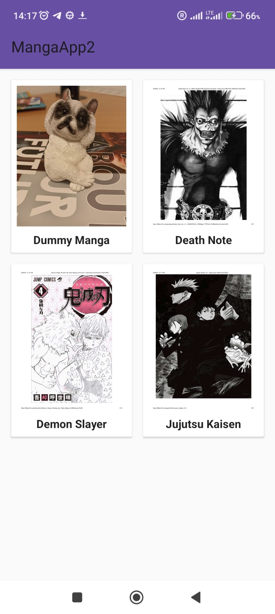
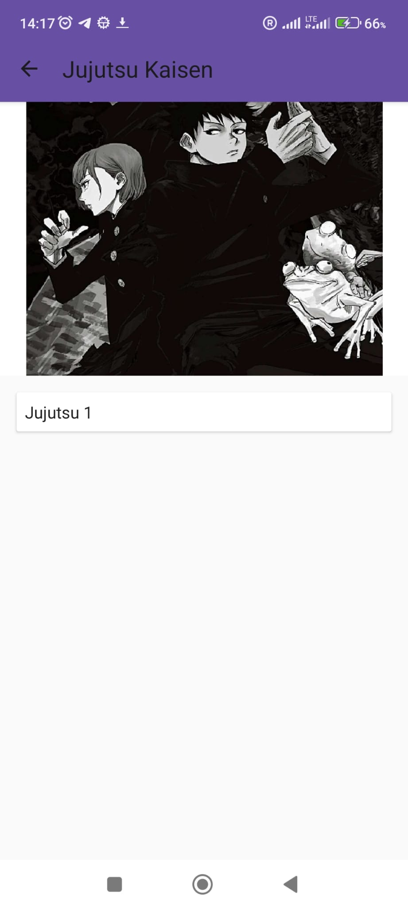
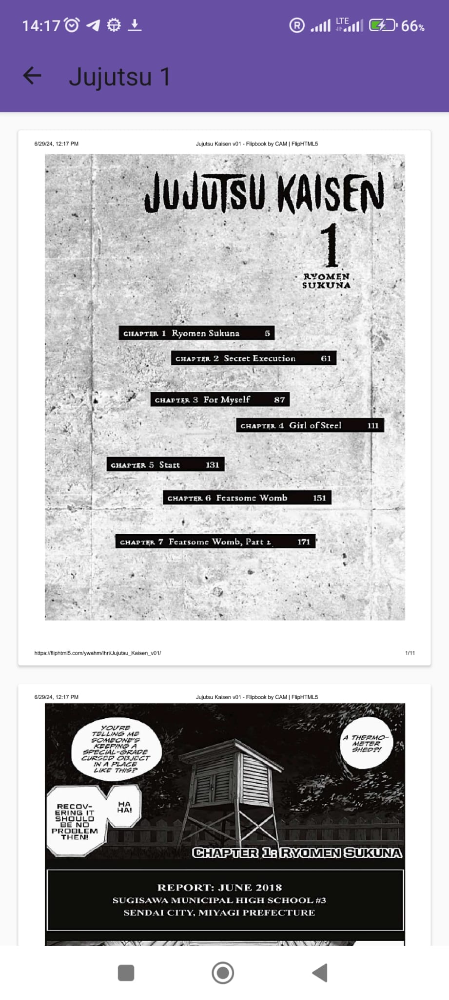

# MangaApp

A Kotlin-based Android application for reading mangas.

## Table of Contents

- [Overview](#overview)
- [Features](#features)
- [Project Structure](#project-structure)
- [Libraries Used](#libraries-used)
- [Setup Instructions](#setup-instructions)
- [Backend Integration](#backend-integration)
- [Navigation and Data Flow](#navigation-and-data-flow)
- [Usage](#usage)
- [Contributing](#contributing)
- [License](#license)

## Overview

MangaApp is an Android application designed for manga enthusiasts to browse, read, and enjoy their favorite manga series.

## Features

- Browse mangas by categories (Comedy, Romance, Thriller).
- View list of episodes for a selected manga.
- Read individual episodes with zoom and scroll functionalities.

## Project Structure

The project is organized as follows:

```
MangaApp/
│
├── app/
│ ├── src/
│ │ ├── main/
│ │ │ ├── java/
│ │ │ │ ├── com.example.mangaapp/
│ │ │ │ │ ├── activities/
│ │ │ │ │ │ ├── MainActivity.kt
│ │ │ │ │ │ ├── EpisodesActivity.kt
│ │ │ │ │ │ ├── ReaderActivity.kt
│ │ │ │ │ ├── adapters/
│ │ │ │ │ │ ├── MangaAdapter.kt
│ │ │ │ │ │ ├── EpisodeAdapter.kt
│ │ │ │ │ │ ├── ReaderAdapter.kt
│ │ │ │ │ ├── models/
│ │ │ │ │ │ ├── Manga.kt
│ │ │ │ │ │ ├── Episode.kt
│ │ │ │ │ │ ├── Page.kt
│ │ │ │ │ ├── network/
│ │ │ │ │ │ ├── ApiService.kt
│ │ │ │ │ │ ├── RetrofitClient.kt
│ │ │ │ │ ├── utils/
│ │ │ ├── res/
│ │ │ │ ├── layout/
│ │ │ │ │ ├── activity_main.xml
│ │ │ │ │ ├── activity_episodes.xml
│ │ │ │ │ ├── activity_reader.xml
│ │ │ │ ├── values/
│ │ │ │ │ ├── colors.xml
│ │ │ │ │ ├── strings.xml
│ │ │ │ │ ├── styles.xml
│ ├── build.gradle
│ ├── proguard-rules.pro
├── build.gradle
├── settings.gradle
├── gradle.properties
```


## Libraries Used

- [Retrofit](https://square.github.io/retrofit/) - For making network requests.
- [Glide](https://github.com/bumptech/glide) - For image loading and caching.
- [RecyclerView](https://developer.android.com/reference/androidx/recyclerview/widget/RecyclerView) - For displaying lists or grids of data efficiently.
- [PhotoView](https://github.com/Baseflow/PhotoView) - For zoomable image views.
- [Gson](https://github.com/google/gson) - For JSON serialization/deserialization.
- [AndroidX Libraries](https://developer.android.com/jetpack/androidx) - Support libraries for modern Android development.

## Setup Instructions

1. Clone the repository:
   ```sh
   git clone https://github.com/yourusername/your-repo.git

2. Open the project in Android Studio.
3. Wait for Gradle sync to complete.
4. Build and run the project on an emulator or physical device.

## Backend Integration
The application connects to a backend service using Retrofit. The backend service returns data in the following format:

### Manga
{
  "id": 1,
  "title": "Manga Title",
  "thumbnail": "https://example.com/image.jpg",
  "description": "Description",
  "category": 1
}

### Episode
{
  "id": 1,
  "title": "Episode Title",
  "description": "Description",
  "chapter_number": 1,
  "manga": 1
}

### Page
{
  "id": 1,
  "page_number": 1,
  "image": "https://example.com/page1.jpg",
  "episode": 1
}


The RetrofitClient and ApiService are used to handle network operations:

- RetrofitClient initializes the Retrofit instance.
- ApiService defines the endpoints for fetching mangas, episodes, and pages.

### Example API Call

```
RetrofitClient.apiService.getMangas().enqueue(object : Callback<List<Manga>> {
    override fun onResponse(call: Call<List<Manga>>, response: Response<List<Manga>>) {
        if (response.isSuccessful) {
            val mangas = response.body() ?: emptyList()
            // Update UI with mangas
        } else {
            // Handle error
        }
    }

    override fun onFailure(call: Call<List<Manga>>, t: Throwable) {
        // Handle network failure
    }
})
```

## Navigation and Data Flow
### MainActivity
Displays a list of mangas in a grid view.
When a manga is selected, it navigates to EpisodesActivity with the selected manga object.
### EpisodesActivity
Displays a list of episodes for the selected manga.
When an episode is selected, it navigates to ReaderActivity with the selected episode and manga object.
### ReaderActivity
Displays pages of the selected episode with zoom and scroll functionalities.
Allows navigating back to EpisodesActivity with the back button.
## Intent Passing
To pass objects between activities, we use the Parcelable interface:

```kotlin
Copy code
val intent = Intent(this, EpisodesActivity::class.java).apply {
    putExtra("manga", selectedManga)
}
startActivity(intent)
```
And retrieving it:

```kotlin
Copy code
val manga: Manga? = intent.getParcelableExtra("manga")
```
### Usage
Provide instructions on how to use the app.

1. Enter the app and click one of the mangas to view episodes



2. Click one of the episodes of that manga to view pages



3. You can read the episode on this page. Each page can be zoomed in and out.

